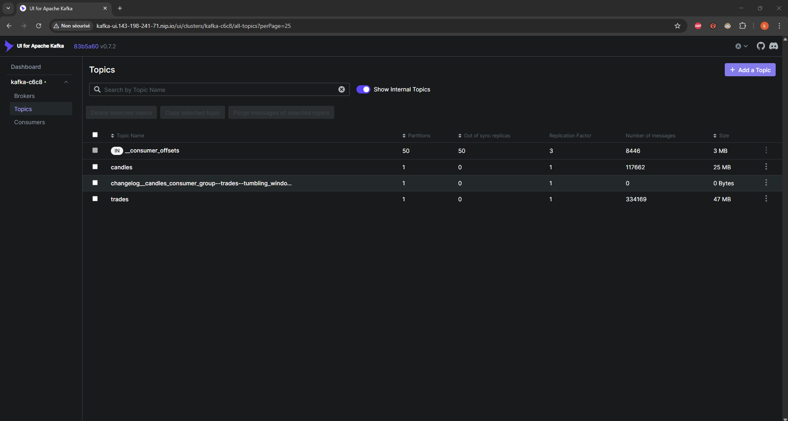
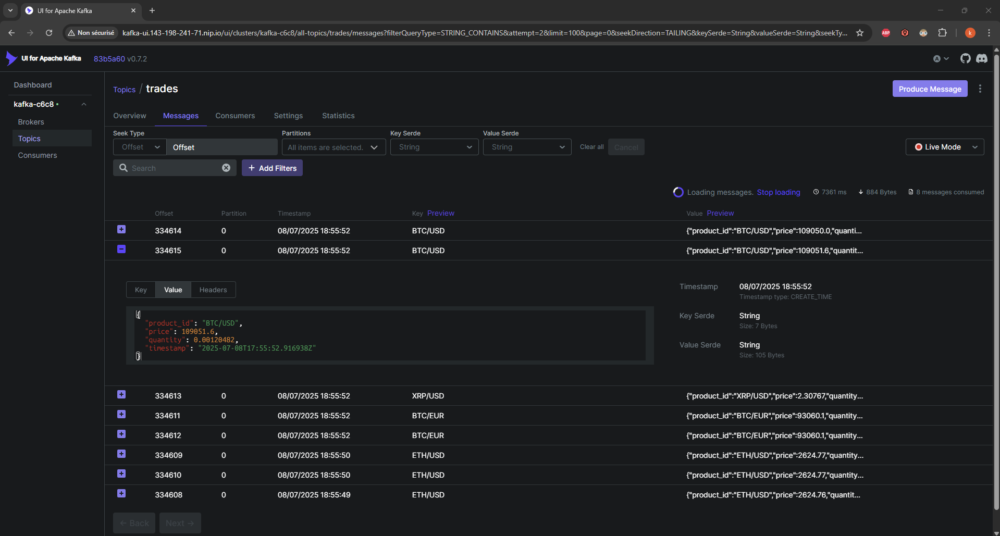

# A few notes about the production cluster

This production cluster used in this project is built with digital ocean thanks to its intuitive design. Before diving into the core architecture of the prod environment and the steps to build it, it is noteworthy to say that the correct building of the local development environment through kind is the stepping stone to production environment whatsoever.

Besides the internal k8s pods, the prod cluster counts the following pods:

- A Kafka cluster using Strimzi
- Kafka UI to monitor Kafka topics
- Services which output the core logic of the project, such as trades and candles services
- FluxCD GitOps for automated cluster deployment sync
- Ingress nginx controller to set up ingress for k8s

This setup uses public GitHub Container Registry (GHCR) images for the services.

---

## Architecture

- **Kafka Cluster**: Strimzi deployed in `strimzi` namespace
- **Kafka UI**: Web UI to monitor Kafka topics, exposed via Ingress
- **Services**: Custom apps producing the logic of the project and presented as Kafka topics
- **FluxCD**: Watches GitHub repository and applies manifests automatically (Optional for gitops)

---

## Prerequisites

- Digital Ocean Kubernetes cluster (4 nodes recommended, you can benefit from the free tier with 200 USD if you are new to the cloud service)
- `kubectl` configured with cluster `kubeconfig` which you can download from your digital ocean dashboard once the cluster is created. Let's assume this file is called `digitalocean-prod.yaml` and is saved under the `~/.kube/` folder in your machine
- Docker CLI configured with GitHub Container Registry authentication
- Flux CLI installed (`flux` command)
- GitHub repository with manifests organized (e.g. `/manifests` folder)

---

## Setup Steps

### 1. Deploy Kafka and Kafka UI

From the root folder, apply Kafka and Kafka UI manifests in the `strimzi` namespace:

```bash
kubectl apply -f deployments/prod/kafka/kafka-c6c8.yaml -n strimzi
kubectl apply -f deployments/prod/kafka/kafka-ui-all-in-one.yaml -n strimzi
```

### 2. Build and push Docker images of the underlying services

For example, you can build the docker image locally via the makefile located at the root folder and don't forget to give it an appropriate tag while following a renowned convention like semver.

Pushing to GHCR can be done with this command

```bash
docker push ghcr.io/<your-gh-user>/<service-name>:0.1.0.<timestamp>
```

Make sure the image is public or configure `imagePullSecrets`.

### 3. Deploy services

For example, in the root folder you can use the following ``make` command

```bash
make deploy-for-prod service=<your-service-name>
```

Notice the address of the container pushed to ghcr is marked in the deployment manifest of the service.

### 4. Expose services with Ingress

To access the Kafka UI from outside the cluster, you need to expose it via an Ingress resource. Ingress is a Kubernetes API object that manages external access to services in a cluster.

We use nip.io for dynamic DNS — it maps your cluster's public IP into a DNS hostname without needing to buy a domain. nip.io provides DNS for free which is perfectly fine for this project, although the resulting DNS is not aesthetic as you might notice hereafter.

Before the deployment of the Ingress resource manifest located at `./kafka/kafka-ui-ingress.yaml`, we should extract the public ip of the ingress controller in the k8s prod cluster. For this you can type this command:

```bash
kubectl get svc -n ingress-nginx
```

Look for the `EXTERNAL-IP` of the ingress controller, for example:

```bash
NAME                                 TYPE           CLUSTER-IP      EXTERNAL-IP       PORT(S)
ingress-nginx-controller             LoadBalancer   10.245.24.217   143.198.241.71    80:31445/TCP,443:31381/TCP
```

Then, your host should be something like `kafka-ui.143-198-241-71.nip.io` which must be the value of the `spec.rules.host` key under the ingress resource manifest.

You can apply now the ingress manifest with the following command from the root project folder:

```bash
kubectl apply -f deployments/prod/kafka/kafka-ui-ingress.yaml
```

### 5. Install FluxCD on the cluster

Install FluxCD in your production cluster using:

```bash
KUBECONFIG=~/.kube/digitalocean-prod.yaml flux install
```

This command:

- Installs FluxCD components (source-controller, kustomize-controller, etc.)
- Creates the flux-system namespace
- Deploys CRDs and controller pods

🧠 Tip: If you use multiple clusters, specify the right `kubeconfig` each time.

### 6. Bootstrap FluxCD with Your GitHub Repo

Now connect FluxCD to your GitHub repository so it can watch your manifests and apply them automatically.

In this case I am interested to watch manifests which are stored in the `prod` folder. So I ran the following command from the project root folder:

```bash
flux bootstrap github \
  --owner=karimabousselham \
  --repository=real-world-crypto-ml-system \
  --branch=main \
  --path=./deployments/prod \
  --personal
```

This creates a folder called `flux-system` and a `Kustomization` resource in that folder.

You can check that FluxCD is watching your repo and syncing changes:

```bash
kubectl get gitrepositories,kustomizations -n flux-system
```

## Results preview

General view of some of the kafka topics built in the production cluster


View of the live mode of the `trades` kafka topic

