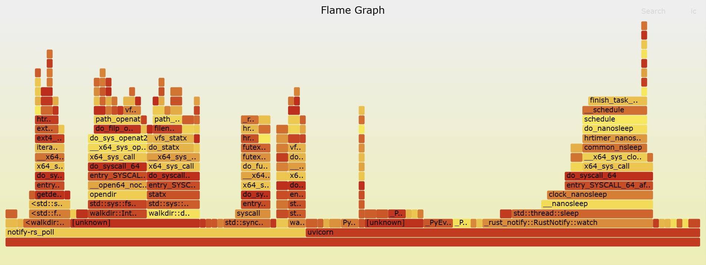
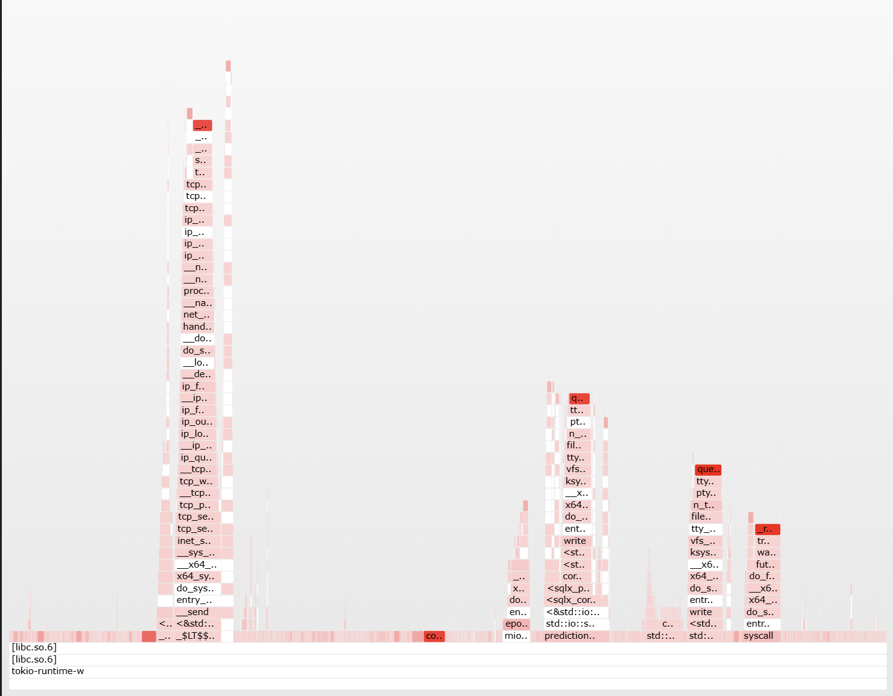

# Generating Flamegraphs for prediction APIs

The goal of this note is to present the approach of plotting the flamegraphs of two APIs coded in this project and compare the underlying performance indicators.  

## Flamegraph definition

A flamegraph is a visualization of profiled software performance data that shows how much CPU time is spent in each function call. It represents the call stack as stacked bars where wider bars indicate more time spent, making it easy to identify performance bottlenecks.

## Diff Flamegraph (Differential Flamegraph)

A diff flamegraph compares two flamegraphs—such as before and after a code change or between two implementations—to highlight differences in CPU usage. It helps quickly spot which functions consume more or less CPU time between the two runs.  
In the present use case, diff flamegraph is meaningless because it supposes both processes to be compared have shared stack
traces which is not the case. In fact, the apps to be compared are coded in different programming languages (i.e, Pythons vs Rust).

## Workflow of the Flamegraphs

In this use case we have created two kinds of prediction APIs with the same kind of requests to be sent: Display EHT/EUR price predictions. One API was written in rust axum included in the folder `services/prediction-api`, while the other one was coded in python through FastAPI and is located in `services/prediction_api_py`.

### Prerequisites for generating a flamegraph for each of the two APIs

You should first install the `perf` which is a powerful Linux performance analysis tool that collects CPU profiling data and other hardware/software event metrics regardless of the programming language used. It helps developers understand how their programs spend time by sampling stack traces, enabling the creation of flamegraphs and detailed performance reports.

The installation of `perf` depends obviously on the OS and running environment of your CLI. For example, you can find the installation instructions of `perf` iw wsl2 right [`here`](https://www.arong-xu.com/en/posts/wsl2-install-perf-with-manual-compile/).

Besides `perf` you will need [`Grafana k6`](https://github.com/grafana/k6) to simulate load tests over both the prediction APIs.

`Grafana k6` is an open-source, developer-centric tool for load testing and performance monitoring of APIs, web services, and applications. It lets you write test scripts in JavaScript, run them locally or in the cloud, and visualize results with Grafana dashboards. And as opposed to what you might think, you don't need a Javascript environment to be installed in your machine for `Grafana k6` to run correctly.

Installation instructions of `Grafana k6` depending on the OS are provided in the [official docs](https://grafana.com/docs/k6/latest/set-up/install-k6/).

The third prerequisite is the installation of [Brendan Gregg’s Flamegraph tools](https://www.brendangregg.com/flamegraphs.html).

Installing the flamegraph tools begins with creating a new directory called `Flamegraph` in your desired parent directory, through the command:

```bash
git clone https://github.com/brendangregg/FlameGraph.git
```

In the following steps, we suppose `Flamegraph` is created under `home` directory.

### Flamegraph generation workflow

The main idea of the workflow is to let the `perf` tool collect samples of stack traces of each API server in order to construct the underlying flamegraph. Therefore, we will need to send requests programmatically to the API server through loading test.

Conducting loading test programmatically is done with `Grafana k6` while the `perf` tool is recording the underlying process.

Below are the detailed steps of the described workflow:  
**Step.1**: Prepare the loading test scenario  
In this use case we chose to load the API with a maximum traffic of 200 virtual users during 15 minutes preceded and followed by 5 minutes ramps.

The loading test script is provided in `stress_test.js` in the present folder.

**Step.2**: Find the PID of the API server  
Use the command:

```bash
ps aux | grep <your-api-name-here>
```

Let the output process ID noted PID in the next steps

**Step.3**: Start recording with `perf`
Use the command:

```bash
sudo perf record -F 99 -p <PID> -g
```

**Step.4**: In another terminal start running the loading test with `Grafana k6`  
Use the command:

```bash
k6 run stress_test.js
```

**Step.5**: In the terminal where perf is running, stop the recording manually once the stress test is finished  

**Step.6**: Generate a folded file
Use these commands from the parent directory of the project:  

```bash
sudo perf script > <programming_language>.perf
<absolute_path>/stackcollapse-perf.pl <programming_language>.perf > <programming_language>.folded
```

**Step.7**: Generate the vectorized format of the Flamegraph
Use the following command from the parent directory of the project:  

```bash
<absolute_path>/flamegraph.pl rust.folded > <programming_language>_flamegraph.svg
```

### Results

Having successfully finished the workflow mentioned below you can find both `python_flamegraph.svg` and `rust_flamegraph.svg` in the project root directory.  

You can notice the `python_flamegraph.svg` has a wider shape than `rust_flamegraph.svg`, , which is a sign of this latter being more efficient and spending less CPU time across multiple call stacks.

**Python Flamegraph**


**Rust Flamegraph**


## Flamegraphs comparison

As you might notice, flamegraphs can be compared in terms of shape. But this is kind of subjective comparison.

Unfortunately, we cannot establish a differential flamegraph for the reasons mentioned earlier. However, we can leverage the `perf stat` command to compare the CPU metrics among others between the FastAPI python service and the Axum rust service.

As in the previous workflow we should each service in the background in a separate terminal.

For example, in the rust case you can only run the binary file using this command from the project parent folder:

```bash
sudo -b env psql_port=<enter the correct port> ./target/release/prediction-api
```

Next step consists of running the `perf stat` command only for one request and saving the output in a txt file. This done with the following in a second terminal for the rust case:

```bash
sudo perf stat -e task-clock,context-switches,page-faults \
curl "http://localhost:<enter the port>/prediction?pair=<enter the pair>" &> rust_perf_output.txt
```

Now you can kill the underlying process and terminate the terminal where the API service is running.

The same steps should be applied to the FastAPI python service.

### Comparison results

The results are stored in both files `rust_perf_output.txt` and `python_perf_output.txt` and show the following facts:

- CPU usage (task-clock): Rust handles the request in 7 ms, Python in 16.5 ms → Rust is about 2–2.5× faster for a single request.

- Context switches: Python has more (19 vs 1) → some extra scheduling overhead.

- Page-faults: Similar, so memory usage is comparable.

- Wall-clock: Python takes longer (66.9 ms) → includes async I/O, database access, and Python interpreter overhead.

Rust is clearly more performant than Python FastAPI for this endpoint and this is expected as Pau Labarta Bajo often assimilates Python with a bycicle and Rust with a rocket.

However⚠️ the caveat is: This is a micro-benchmark for one request. In a real system, Python could scale reasonably under high concurrency with async I/O, but Rust will almost always have a lower latency per request.
